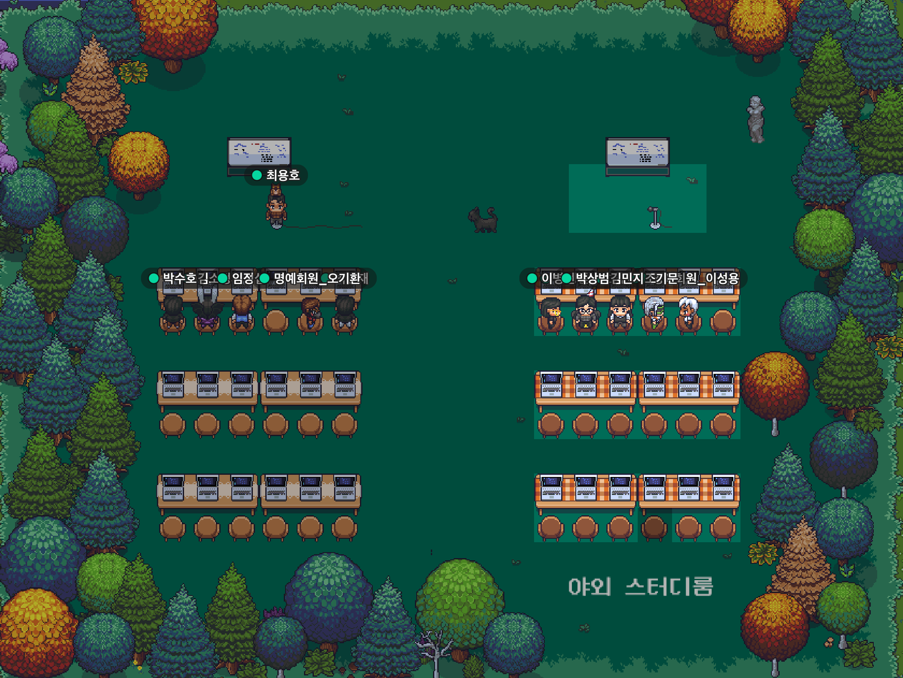
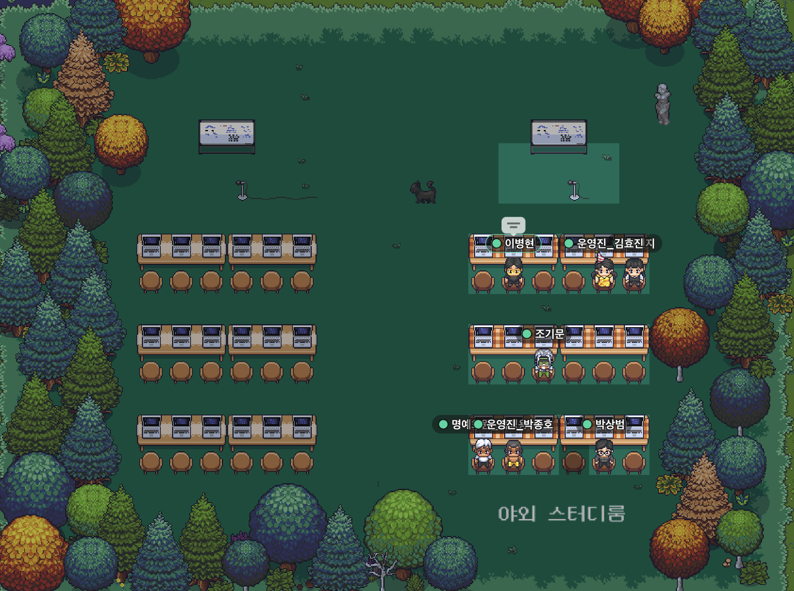

# 💙 자바스크립트 완벽 가이드 7판 스터디

## 📚 스터디 진행방식

- 총 14주 동안 끝까지 읽는것을 목표!
- 매주 토요일 오후 1시에 진행, 사정이 있으면 미리 말해서 평일 오후 10시로 조율 가능
- 매주 정해진 분량을 읽고 자신만의 방식으로 글로 정리해서 올리기
- 1주일에 1번 모여 약 1시간 가량 스터디 진행
- 스터디 시간에 랜덤으로 발표자를 선정해 30분정도 발표하고, 이후 시간에는 자유롭게 토론
- 스터디 규칙

  - 발표자로 선정이 되었는데 발표준비를 안했거나 스터디에 불참하면 옐로카드 1장
  - 옐로카드 3장 = 퇴출
  - 묻지마 불참권 2번
  - 디프만 출석기준 경조사 인정

## 🐥 스터디 참여자

| 이름                                      | 한줄목표                                                      | 옐로카드 | 묻지마 불참권 |
| ----------------------------------------- | ------------------------------------------------------------- | -------- | ------------- |
| [김효진](https://github.com/hy57in)       | 내 인생에 끝까지 읽어보는 개발책 한권 만들어보자              |          |               |
| [김민지](https://github.com/mnxmnz)       | 자바스크립트 잘하고 싶다 🥺                                   |          |               |
| [조기문](https://github.com/guymoon)      | 코뿔소랑 베프되기                                             | 🟨       |               |
| [이병현](https://github.com/Tolluset)     | 완주가 목표 🏃🏻                                                |          |               |
| [이성용](https://github.com/SeongYongLee) | 이미 책 다 읽고 회고하는 상상까지 다 함                       |          | 🟥            |
| [박종호](https://github.com/jonghopark95) | 전 회고 끝내고 뒷풀이 때 성용이형이 술값 계산하는 상상까지 함 |          |               |

## 🗓 스터디 일정

| 회차 | 일시                | 목차     | 참여자      | 발표자             | 비고    |
| ---- | ------------------- | -------- | ----------- | ------------------ | ------- |
| 0    | 4월 16일 (토) 13:30 | 1,2,3 장 | All         |                    |         |
| 1    | 4월 23일 (토) 13:00 | 4장      | 성용 외 All | 3장:병현, 4장:기문 | 3장,4장 |
| 2    | 4월 30일 (토) 13:00 | 5장      | All         | 종호               |         |
| 3    | 5월 7일 (토) 13:00  | 6장      | All         | 병현               |         |
| 4    | 5월 14일 (토) 13:00 | 7장      |             |                    |         |
| 5    | 5월 28일 (토) 13:00 |          |             |                    |         |
| 6    | 6월 4일 (토) 13:00  |          |             |                    |         |
| 7    | 6월 11일 (토) 13:00 |          |             |                    |         |
| 8    | 6월 18일 (토) 13:00 |          |             |                    |         |
| 9    | 6월 25일 (토) 13:00 |          |             |                    |         |
| 10   | 7월 2일 (토) 13:00  |          |             |                    |         |
| 11   | 7월 9일 (토) 13:00  |          |             |                    |         |
| 12   | 7월 16일 (토) 13:00 |          |             |                    |         |
| 13   | 7월 23일 (토) 13:00 |          |             |                    |         |

### 사진첩

| 4/16                                        | 4/23                                          | 4/30                                          |
| ------------------------------------------- | --------------------------------------------- | --------------------------------------------- |
|                  |  |  |
| 5/7                                         | 5/14                                          | 5/28                                          |
|  |                   |                   |
| 6/4                                         | 6/11                                          | 6/18                                          |
|                  |                   |                   |
| 6/25                                        | 7/2                                           | 7/9                                           |
|                  |                   |                   |
| 7/16                                        | 7/23                                          |                                               |
|                  |                   |                   |

## 📍 목차

1장 자바스크립트 소개

2장 어휘 구조

3장 타입, 값, 변수

4장 표현식과 연산자

5장 문

6장 객체

7장 배열

8장 함수

9장 클래스

10장 모듈

11장 자바스크립트 표준 라이브러리

12장 이터레이터와 제너레이터

13장 비동기 자바스크립트

14장 메타프로그래밍

15장 웹 브라우저의 자바스크립트

16장 노드와 서버 사이드 자바스크립트

17장 자바스크립트 도구와 확장
